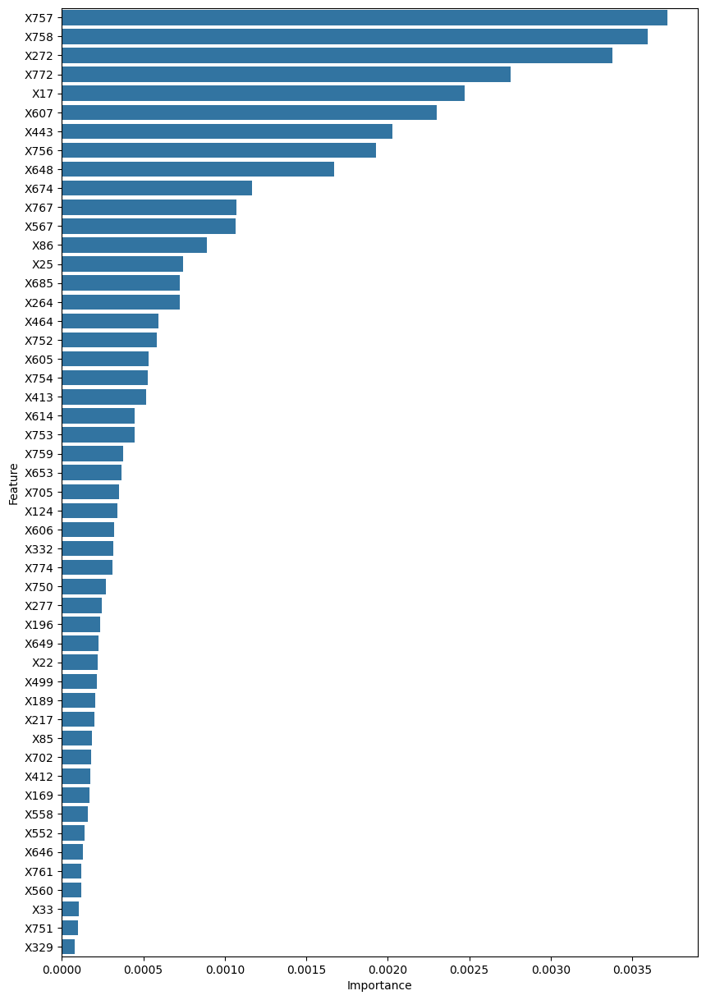
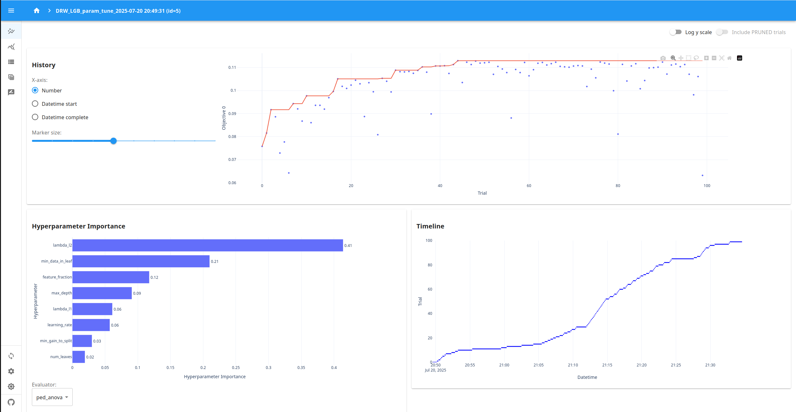

# DRW - Crypto Market Prediction

Kaggle 대회

https://www.kaggle.com/competitions/drw-crypto-market-prediction/overview


---

## 프로젝트 개요

Kaggle의 암호화폐 거래 데이터 예측 대회에 참가하여 **상위 11%** 성적을 거두었습니다.

익명화된 거래 내역 데이터(X1~X780, label)를 활용해 미래의 타겟 변수를 예측하였으며, 다양한 Feature Engineering (nonlinear transforms, row-wise aggregations, combination interactions)을 적용했습니다. LightGBM과 SHAP을 이용한 Feature Selection을 수행하였고, Optuna로 Hyperparameter Tuning을 자동화하여 성능을 극대화했습니다. 예측 모델로는 LightGBM, XGBoost, CatBoost를 Ensemble 하였습니다.

대회 평가지표로는 Pearson Correlation Coefficient가 사용되었으며, 저는 최종적으로 0.08230을 달성하였고, 상위 10개 팀의 평균 점수(0.11433: 아래 링크 참조)와 비교해 데이터 특성상 한계가 있었음을 확인할 수 있었습니다. 그러나 다양한 ML 기법을 적용하여 성능을 끌어올린 경험은 실무적인 인사이트로 이어졌습니다.

https://www.kaggle.com/competitions/drw-crypto-market-prediction/leaderboard

---

## 기술 스택

- **Language**: Python
- **ML Models**: XGBoost, LightGBM, CatBoost
- **Hyperparameter Tuning**: Optuna
- **Feature Selection**: SHAP
- **Data Manipulation & Analysis:** Pandas, NumPy, itertools
- **Visualization**: Matplotlib, Seaborn, Optuna Dashboard
- **Cross-validation**: TimeSeriesSplit (Scikit-learn)
- **OS**: Linux (Ubuntu Desktop 24.04 LTS)
- **IDE**: VSCode, Jupyter Notebook

---

## 문제

암호화폐 시장은 빠르게 변화하는 동시에 예측이 매우 어려운 시장으로, 가격 변동은 유동성, 주문 흐름, 투자자 심리, 구조적 비효율성 등 다양한 요인에 의해 좌우됩니다. 이 때문에 데이터에서 의미 있는 신호를 찾는 것이 쉽지 않습니다.

본 대회의 목표는 DRW의 실제 거래 전략에 활용되는 생산 환경(production) 특성과 공개된 시장 데이터를 함께 활용하여, 단기 암호화폐 선물 가격 변동을 예측하는 모델을 구축하는 것입니다. 참가자는 수백 개의 고차원 특성(X1~X780)과 거래량 관련 지표를 통합하여, 노이즈가 많은 환경에서도 가격 방향성을 효과적으로 포착할 수 있는 예측 신호를 생성해야 합니다.

---

## 데이터셋

Kaggle을 통해 DRW Trading이 제공한 데이터셋은 아래를 포함합니다 (https://www.kaggle.com/competitions/drw-crypto-market-prediction/data).

**train.parquet**

The training dataset containing all historical market data along with the corresponding labels.
학습 데이터셋으로, 모든 과거 시장 데이터와 해당하는 레이블이 포함되어 있습니다.

|컬럼명|설명|
|---|---|
|timestamp|각 행이 해당하는 분(minute)을 나타내는 타임스탬프 인덱스.|
|bid_qty|주어진 시점에서 매수자가 최고 매수 호가로 사고자 하는 총 수량.|
|ask_qty|주어진 시점에서 매도자가 최저 매도 호가로 팔고자 하는 총 수량.|
|buy_qty|해당 분 동안 최저 매도 호가에서 체결된 매수 거래 총량.|
|sell_qty|해당 분 동안 최고 매수 호가에서 체결된 매도 거래 총량.|
|volume|해당 분 동안 체결된 총 거래량.|
|X_{1,...,780}|독점 데이터 소스로부터 도출된 익명화된 시장 특징(feature) 집합.|
|label|예측해야 하는 익명화된 시장 가격 변동을 나타내는 타깃 변수.|

**test.parquet**

테스트 데이터셋은 train.parquet과 동일한 특징 구조를 가지지만, 다음과 같은 차이가 있습니다:

- **timestamp:** 미래 데이터를 미리 알 수 없도록 모든 타임스탬프가 마스킹되고, 셔플된 후 고유 ID로 대체됨.
- **label:** 테스트 세트의 모든 레이블은 0으로 설정됨.

**sample_submission.csv**

제출 형식을 보여주는 샘플 파일입니다. 제출물은 이 샘플 파일과 동일한 행(row) 수와 구조를 따라야 유효한 것으로 간주됩니다.

---

## 방법론 및 접근 방식

본 프로젝트는 포괄적인 머신러닝 파이프라인을 설계하여 데이터 전처리, 피처 엔지니어링, 모델링, 튜닝, 앙상블까지 전체 과정을 체계적으로 수행했습니다.

### 1. 데이터 전처리 & Feature Pruning
- 상수값/중복/저분산 컬럼 제거
- Pearson Corr > 0.9 피처 중 하나 제거

### 2. Feature Selection & Engineering
- **SHAP + LightGBM + TimeSeriesSplit**으로 중요도 기반 선택  
- Top 20 피처 중심으로 row-wise, nonlinear, interaction engineering 진행  
- 최종적으로 상위 200개 피처 선정  
*(세부 코드는 `/drw2025/1_feature_engineering_and_selection_lgb.ipynb` 참고)*



*Figure 1. SHAP 기반 Feature Importance*

### 3. 모델 학습 & 검증
- XGBoost, LightGBM, CatBoost 등 GBDT 계열 사용
- TimeSeriesSplit 기반 검증, RMSE 손실로 성능 모니터링
- 과적합 방지: early stopping, L1/L2 regularization
- **학습 손실은 RMSE를 사용했지만, 검증/튜닝은 Pearson 기반 커스텀 metric으로 일치**


*Figure 2. Training & Validation Learning Curves*

### 4. Hyperparameter Tuning
- **Optuna**로 자동화된 하이퍼파라미터 탐색 수행  
- 피처 개수도 하이퍼파라미터에 포함하여 최적의 feature subset 탐색



*Figure 3. LightGBM Optuna 하이퍼파라미터 튜닝 Optuna Dashboard*

### 5. Ensemble (Blending)
- 각 모델의 예측을 CV 성능 기반 가중 평균  
- 단일 최고 CV(0.1509) 대비 +0.0067p, **+4.4% 개선**


*Figure 4. Ensemble 결과*

| Model         | CV (Pearson) | LB (Pearson) |
|---------------|--------------|--------------|
| LightGBM      | 0.1169       | -            |
| XGBoost       | 0.1315       | -            |
| CatBoost      | 0.1509       | -            |
| Blending      | 0.1576       | 0.0823       |

*단일 모델의 LB는 제출/관리 비용 문제로 미산출. 최종 제출은 Blending 결과 사용.*

---

## 결과 및 주요 관찰

- **달성한 Pearson 점수:** 제 모델은 최종 테스트 세트에서 0.08230의 Pearson 점수로 **상위 11%를 달성**하였습니다. 그러나 대회 상위 10개 팀의 점수가 0.11433인 점을 고려할 때, 주어진 공개 특성만으로는 추가 개선 폭이 제한적이었습니다.
- **[핵심 관찰 1]:** CV와 LB의 큰 차이는 제 모델이 일반화에 실패하였으며, 개선의 여지가 있다는 것을 의미합니다.
- **[핵심 관찰 2]:** 익명화되지 않은 데이터셋이라면 더 다양하고 높은 퀄리티의 Feature Engineering이 가능할 것이며, 이는 모델 성능의 향상으로 직결될 것입니다.
- TimeSeriesSplit에도 불구한 CV 대비 LB 하락은 검증 설정/전처리 파이프라인에서의 잠재적 누수를 시사합니다. 다음 버전에서는 walk-forward + embargo, fold-내 전처리/선택, Pearson 기반 early stopping으로 재평가할 예정입니다.

```
Split1: [ Train .......... ][ Val1 ]
Split2: [ Train .................. ][ Val2 ]
Split3: [ Train .......................... ][ Val3 ]
(향후: 경계에 embargo n-step 적용 검토)
```

---

## 결론 및 향후 과제

본 프로젝트는 암호화폐 시장 가격의 움직임을 예측하는 모델을 개발하려고 시도하였으며, Time Series 데이터를 다루고 머신러닝 기술을 적용하는 능숙함을 보여주었습니다. 얻어진 관찰은 암호화폐 가격 예측에 데이터 기반 접근 방식의 잠재력을 부각시킵니다.

**향후 개선 사항:**
* 외부 데이터(온체인/심리 지표 등) 통합 및 데이터 증강
* 실무 적용 관점의 XAI(특징 기여·리스크 모니터링) 보강.
* CV 점수(0.1576)와 LB 점수(0.0823) 간의 현저한 차이를 조사하는 것. 이는 과적합을 나타낼 수 있습니다.
* 더 나은 앙상블 기법 적용.
* 더 나은 CV 전략 구상.

---

## 프로젝트 실행 방법

분석 및 모델 훈련 재현 방법:
*재현성: seed=42 고정, 모든 split/튜닝 동일 seed 사용. 환경은 requirements.txt 참고.*

1.  **Repository 복제:**
    ```bash
    git clone [https://github.com/madmax0404/kaggle-drw-crypto-market-prediction-2025.git](https://github.com/madmax0404/kaggle-drw-crypto-market-prediction-2025.git)
    cd kaggle-drw-crypto-market-prediction-2025
    ```
2.  **데이터셋 다운로드:**
    * 캐글에서 대회에 참가하세요. [DRW - Crypto Market Prediction](https://www.kaggle.com/competitions/drw-crypto-market-prediction/)
    * 데이터를 다운받은 후 알맞은 디렉토리에 저장하세요.
3.  **가상 환경을 생성하고 필요한 라이브러리들을 설치해주세요:**
    ```bash
    conda create -n DRW python=3.12 # or venv
    conda activate DRW
    pip install -r requirements.txt
    ```
4.  **Jupyter Notebook을 실행해주세요:**
    ```bash
    jupyter notebook drw2025
    ```
    데이터 처리, 모델 훈련 및 평가를 실행하려면 노트북의 단계를 따르세요.

---

## Acknowledgements

데이터셋과 대회 플랫폼을 제공한 DRW Trading과 Kaggle에 감사드립니다.

본 프로젝트는 다음 오픈소스의 도움을 받았습니다: LightGBM, XGBoost, CatBoost, Optuna, SHAP, scikit-learn, pandas, numpy, matplotlib, seaborn, Jupyter.

모든 데이터 이용은 대회 규정과 라이선스를 준수합니다.

---

## License

Code © 2025 Jongyun Han (Max). Released under the MIT License.
See the LICENSE file for details.

Note: Datasets are NOT redistributed in this repository.
Please download them from the official Kaggle competition page
and comply with the competition rules/EULA.
